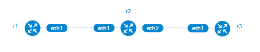

# gobgp-mrt-injection-lab
This lab shows how to read routes from [MRT files](https://datatracker.ietf.org/doc/html/rfc6396), import those routes in GoBGP, then advertise them to a peer. There is a lot of information online about how to create MRT dumps, but information about how to get MRT data back into a routing daemon is almost non-existent. There are a few tools and scripts for doing so. The GoBGP support for importing data from MRT files seems to be the most robust option so far.

## Lab Components
The following components were used for this lab:
- Host machine running [Fedora 39](https://fedoraproject.org/server/download/)
- [Containerlab 0.59.0](https://containerlab.dev/)
- [Debian 12](https://www.debian.org/index.html) containers from [Docker Hub](https://hub.docker.com/_/debian) running in Containerlab
- [GoBGP](https://osrg.github.io/gobgp/) version 3.10.0 which was available through the Debian package manager
- [BIRD](https://bird.network.cz/) version 2.0.12 which was available through the Debian package manager
- Custom Docker containers for GoBGP and BIRD
- MRT dumps from RIPE or RouteViews

## Lab Setup
The lab topology according to the containerlab graph looks like this: 
  
Some more info about the setup and nodes used:  
| Node | AS | lo0 IP | eth1 IP | eth2 IP |
| --- | --- | --- | --- | --- |
| r1 | 65001 | 10.255.255.1 | 10.255.254.1/30 | N/A |

## Bootstrapping The Lab
a

## Information Sources
The following resources were referenced for building this lab:
- [GoBGP documentation](https://github.com/osrg/gobgp/blob/master/README.md)
- [This excellent JPNAP GoBGP Tutorial](https://blog.netravnen.com/wp-content/uploads/2019/08/ixbrforum10day3gobgptutorial-161205210258.pdf) with YAML examples! Such a relieve after the unreadable TOML stuff in the official docs
- [BIRD 2 User's Guide](https://bird.network.cz/?get_doc&f=bird.html&v=20)
- [This excellent BIRD introduction](https://blog.kintone.io/entry/bird) on the Kintone Engineering Blog
- [Another BIRD example](https://deploy.equinix.com/developers/guides/configuring-bgp-with-bird/) by Equinix
